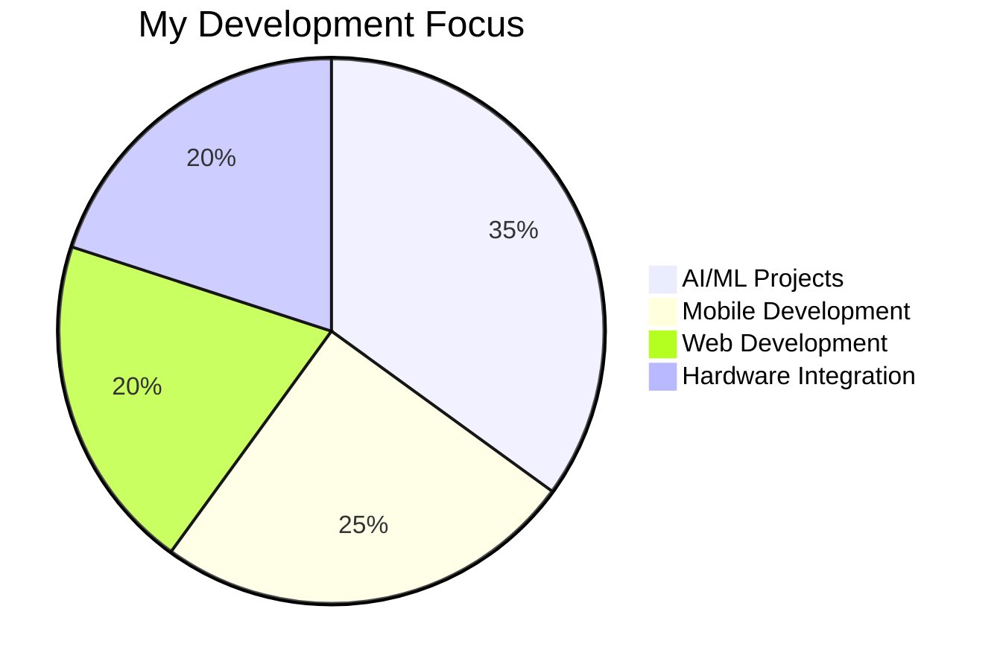

# 👋 Hey there! I'm Nakul Desai

<div align="center">


[](https://git.io/typing-svg)

</div>

---

## 🌟 About Me


```javascript
const nakul = {
    name: "Nakul Desai",
    location: "Vadodara, Gujarat, India 🇮🇳",
    education: "Bachelor of Engineering in IT (2024-2028)",
    code: ["Python", "JavaScript", "PHP", "C", "C#", "Flutter"],
    askMeAbout: ["web dev", "mobile apps", "AI/ML", "IoT"],
    technologies: {
        frontend: {
            web: ["HTML", "CSS", "JavaScript"],
            mobile: ["Flutter"]
        },
        backend: {
            frameworks: ["Flask", "Django", "SocketIO"],
            databases: ["MySQL", "SQLite3", "MongoDB"]
        },
        aiMl: ["TensorFlow", "Keras"],
        hardware: ["ESP32", "TOF Sensor", "Servo Motor"],
        tools: ["Git", "GitHub", "Google Cloud Console", "Blender", "Unity"],
        concepts: ["OOP", "3D Scanning", "IoT"]
    },
    currentFocus: "Building AI-powered solutions",
    funFact: "I turn ideas into reality with code and hardware! 🛠️"
};
```

## 🔥 What I'm Up To

- 🔭 Currently working on **KisanSahayak** - AI-powered agricultural solutions
- 🌱 Learning **Advanced AI/ML and Cloud Technologies**
- 🎓 Pursuing **Bachelor of Engineering in IT** at SVIT, Vasad
- 👯 Looking to collaborate on **Open Source Projects**
- 💬 Ask me about **Flutter, AI/ML, or Agricultural Tech!**
- ⚡ Fun fact: **I build both software and hardware solutions! 🚀**

## 🛠️ Tech Arsenal

<div align="center">

### 🚀 Programming Languages


### 🎨 Frontend & Mobile


### ⚙️ Backend & Frameworks


### 🗄️ Databases


### 🤖 AI/ML & Hardware


### ☁️ Tools & Platforms


</div>

## 📊 GitHub Analytics

<div align="center">

### 🔥 Contribution Stats


### 📈 Commit Streak & Activity


### 📊 Contribution Summary


<table>
<tr>
<td>


</td>
<td>


</td>
</tr>
<tr>
<td>


</td>
<td>


</td>
</tr>
</table>

</div>

## 🏆 GitHub Trophies

<div align="center">

[](https://github.com/ryo-ma/github-profile-trophy)

</div>

## 🎯 Current Focus



---


---

## 🌟 Featured Projects

<div align="center">

### 🌾 KisanSahayak - AI-Powered Agricultural Solutions
[](https://github.com/akashdolani/Empowering-Small-and-Marginal-Farmers-with-AI-Driven-Agricultural-Solutions)

**Tech Stack:** Flutter | Firebase | TensorFlow | Keras  
A multilingual AI-powered mobile app supporting small and marginal farmers with:
- 🔍 Crop disease detection via smartphone photos
- 🌱 Organic solutions in English & Hindi
- ⏰ Smart task reminders
- 🤖 AI chatbot assistance
- 🛒 Integrated agri-marketplace


### 🖨️ 3D Scanning System
[](https://github.com/bravetiger01)

**Tech Stack:** ESP32 | TOF Sensor | Servo Motor  
A functional, low-cost 3D scanner that accurately reconstructs objects with an intuitive user interface.

### 🌐 Other Notable Projects
[](https://github.com/bravetiger01/farmbyte)
[](https://github.com/bravetiger01/Django-CRM-Project)

</div>

## 📈 Contribution Metrics

<div align="center">

### 📊 Detailed GitHub Stats


### 📈 Contribution Activity Graph


### 📋 GitHub Metrics Dashboard


</div>

## 🎓 Education & Achievements

<table>
<tr>
<td width="50%">
<h3>🎓 Current Education</h3>
<p><strong>Bachelor of Engineering in IT</strong><br>
SVIT, Vasad (2024-2028)<br>
Expected Graduation: Feb 2025</p>
</td>
<td width="50%">
<h3>🏆 Academic Achievement</h3>
<p><strong>12th Board Examination</strong><br>
Airport School, Ahmedabad<br>
Score: 88.6% (Mar 2024)</p>
</td>
</tr>
</table>

## 🤝 Let's Connect!

<div align="center">

[](https://linktr.ee/bravetiger01)
[](https://github.com/bravetiger01)
[](mailto:nakulldesai2006@gmail.com)
[](tel:+917016443150)

</div>

---

<div align="center">

### 💭 Random Dev Quote


---


### 📊 Profile Views


</div>

---

<div align="center">


**✨ "Hardworking and passionate developer eager to build innovative solutions that make a difference!" ✨**

**🌱 Currently seeking opportunities to contribute to meaningful projects and grow as a developer 🌱**

</div>
